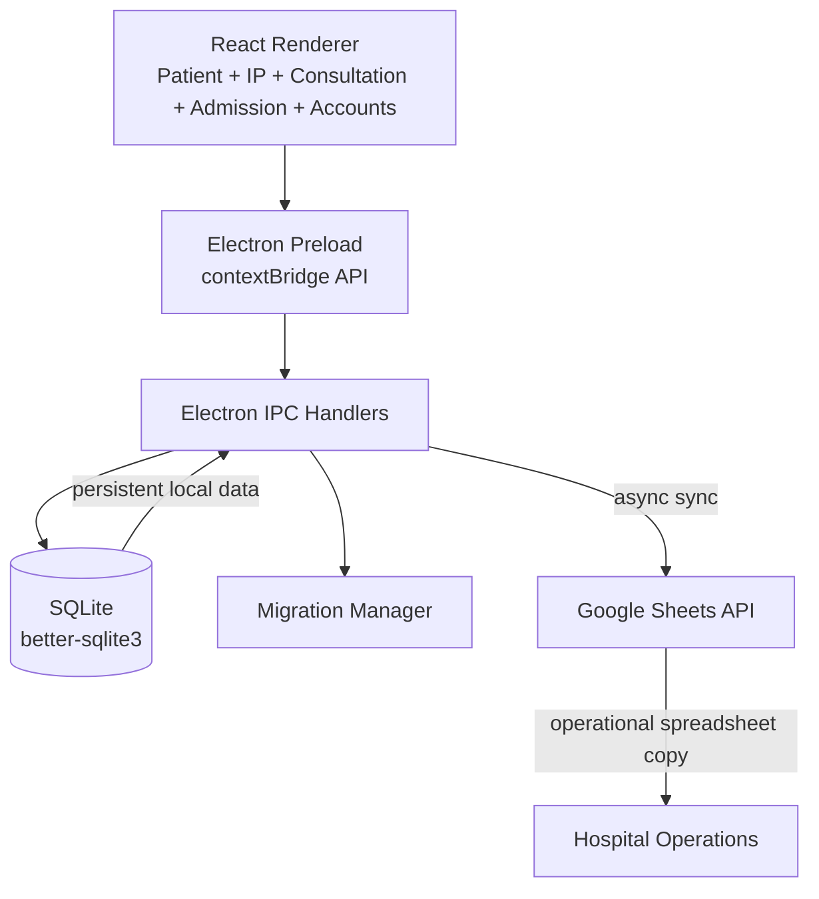

<div align="center">

# Kara HMS

### Desktop Hospital Management System for Outpatient, Inpatient & Financial Operations

Built with **React + TypeScript + Electron + SQLite**, with Google Sheets synchronization for operational records.

[Features](#features) · [Architecture](#architecture) · [Data Flow](#data-flow) · [Tech Stack](#tech-stack) · [Getting Started](#getting-started) · [Project Structure](#project-structure) · [Current Scope](#current-scope)

</div>

---

## Overview

Kara HMS is a desktop-first hospital management application designed to keep day-to-day hospital workflows local, fast, and easy to operate. The application uses **Electron** as the desktop runtime, **React** for the UI, and **SQLite** for persistent local storage.

The current implementation separates the renderer from privileged backend operations using Electron's **preload + IPC** boundary. Patient registration and inpatient creation are persisted locally and asynchronously synchronized to **Google Sheets**, while the UI provides modules for patient registration, inpatient workflows, consultation, admission, and accounts.

## Features

### Patient Management

- Outpatient patient registration with schema validation using **AJV + JSON Schema**.
- Automatic patient ID and daily registration number generation.
- Patient search by name or patient ID.
- Persistent patient records in SQLite.
- Patient vitals support including weight, height, temperature, pulse, blood pressure, respiratory rate, and oxygen saturation.

### Inpatient Management

- Create inpatient records from an existing outpatient patient.
- Automatic IP identifiers and IP numbers.
- Admission metadata including visit details, department, priority, referral, medications, and validity.
- Vital signs stored as structured JSON in SQLite.
- Active inpatient status tracking.

### Consultation & Admission Workflows

- Consultation workflow UI for managing inpatient records.
- Admission workflow UI with medication and billing interactions.
- Patient selection flows from OP registration into IP creation.

### Accounts

- Income and expense transaction management.
- Revenue, expense, net-profit, and transaction summary cards.
- Financial charts for transaction analysis.

### Google Sheets Integration

- Patient registration records can be synchronized to a Google Sheet.
- Inpatient records can be synchronized to a separate `IP` sheet.
- Synchronization is intentionally non-blocking: local database writes complete without waiting for Google Sheets.

## Architecture



## Data Flow

### Patient Registration

```text
React Patient Registration
        |
        v
window.api.registerPatient()
        |
        v
Electron IPC: patient:register
        |
        +--> AJV / JSON Schema validation
        |
        +--> Generate patient ID + daily number
        |
        +--> SQLite INSERT
        |
        +--> Return saved patient to renderer
        |
        `--> Async Google Sheets synchronization
```

### Inpatient Creation

```text
Existing OP Patient
        |
        v
IP Creation Form
        |
        v
window.api.createIP()
        |
        v
Electron IPC: ip:create
        |
        +--> Generate IP ID / IP number
        |
        +--> Persist admission + visit + vitals data
        |
        +--> Return IP record to renderer
        |
        `--> Async Google Sheets synchronization
```

## Persistence & Recovery

SQLite is stored under Electron's application user-data directory rather than inside the project directory. This keeps hospital data separate from the application bundle.

The database initializes through a small migration system. A `meta` table stores the current schema version, and pending migrations are applied sequentially during startup.

Current migrations cover:

- `patients` table creation.
- Daily patient numbering.
- Removal of the old daily-counter table.
- `ip_patients` table creation.
- Inpatient schema evolution.

## Security Boundary

The renderer does **not** receive direct Node.js access. Electron is configured with:

```text
contextIsolation: true
nodeIntegration: false
```

Privileged operations are exposed through a controlled `contextBridge` API in the preload process and handled through Electron IPC in the main process.

## Tech Stack

| Layer | Technology |
|---|---|
| Desktop Runtime | Electron 30 |
| Frontend | React 18 + TypeScript |
| Build Tool | Vite 6 |
| Styling | Tailwind CSS 4 |
| UI Components | Radix UI + custom components |
| Validation | AJV + JSON Schema + Zod |
| Local Database | SQLite + better-sqlite3 |
| Charts | Recharts |
| Icons | Lucide React |
| Forms | React Hook Form |
| Notifications | Sonner |
| External Sync | Google Sheets API |
| Documents | React PDF / pdfmake |

## Project Structure

```text
Kara-hms/
├── electron/
│   ├── main.ts                  # Electron application entry point
│   ├── preload.ts               # Secure renderer/main bridge
│   └── backend/
│       ├── db/
│       │   ├── db.ts            # SQLite initialization + persistence path
│       │   └── migrations.ts    # Versioned schema migrations
│       ├── ipcHandlers/
│       │   ├── patients.ts      # OP patient IPC handlers
│       │   └── ip.ts            # IP record IPC handlers
│       └── utils/
│           └── id.ts            # ID/date utilities
├── src/
│   ├── App.tsx                  # Application shell and top-level navigation
│   ├── components/
│   │   ├── PatientManagement.tsx
│   │   ├── PatientRegistration.tsx
│   │   ├── IPCreation.tsx
│   │   ├── ConsultationManagement.tsx
│   │   ├── AdmissionManagement.tsx
│   │   ├── AccountsManagement.tsx
│   │   └── ui/                  # Reusable UI primitives
│   ├── lib/
│   │   └── ipc.ts               # Renderer-side IPC helpers
│   └── types/                   # Shared domain types
├── shared/
│   └── patient.schema.json      # Patient validation schema
├── keys/                        # Local Google service-account credentials
└── package.json
```

## Getting Started

### Prerequisites

- Node.js 20+
- npm
- A Google Cloud service account if Google Sheets synchronization is required.

### Installation

```bash
npm install
```

### Development

Start the Vite renderer:

```bash
npm run dev
```

The Electron application expects the Vite development server at:

```text
http://localhost:5173/
```

### Production Build

```bash
npm run build
```

To launch the Electron application from the built output:

```bash
npm start
```

## Google Sheets Setup

Google Sheets synchronization requires a service-account credential file at:

```text
keys/google-service-account.json
```

The target spreadsheet must be shared with the service-account email and the spreadsheet ID must be configured in the Google integration module.

**Do not commit service-account credentials or other secrets to Git.**

## Current Scope

The repository currently combines two levels of implementation maturity:

- **Persisted:** outpatient patients and inpatient records are stored in SQLite.
- **Synchronized:** OP and IP records can be pushed to Google Sheets asynchronously.
- **UI-driven:** consultation, admission, medication, billing, and account workflows are present in the renderer.
- **In-memory:** several consultation/admission/account interactions currently live in React state rather than SQLite-backed domain tables.

This makes the project a strong foundation for evolving toward a complete local-first HMS while keeping the persistence boundary explicit.

## Roadmap

- Persist consultation, admission, medication, and billing entities.
- Add transactional relationships between OP → IP → consultation → admission → billing.
- Add authentication and role-based access control.
- Move Google Sheets configuration to environment/configuration rather than source code.
- Add automated tests for IPC handlers, migrations, validation, and critical workflows.
- Add production packaging and auto-update support for desktop deployment.

---

<div align="center">

**Kara HMS · Local-first hospital operations**

</div>
